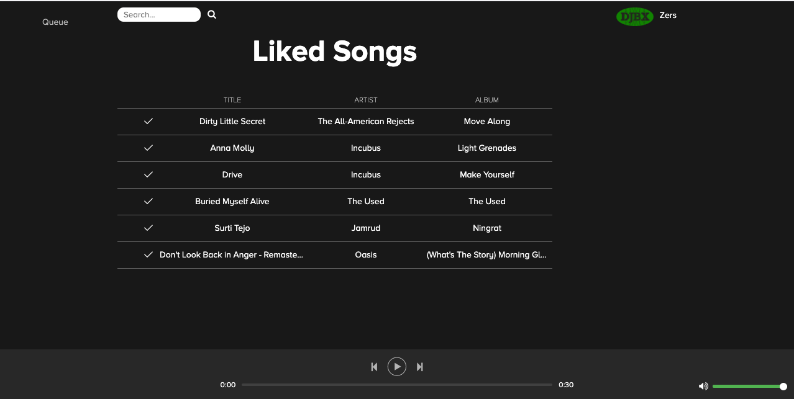

# React-Spotify 🎺🎸🎻🎤

This is `React-Spotify`, a React front end client that communicates with the Spotify API.



If you wish to run the code locally run the following.

```
$ npm install
$ npm start
visit http://localhost:3000
```

You can also run as an electron app by running `yarn run electron-start`.

Please note that the Spotify API only provides 30 second audio snippets.
